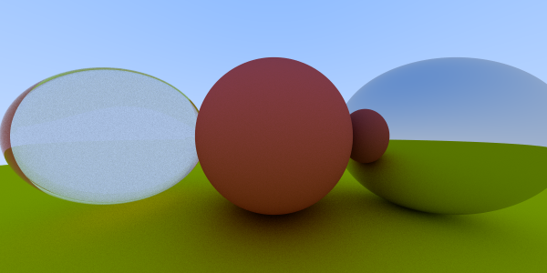

# Raytracer

This repository contains a simple raytracer written in Rust. It is based on the book [Ray Tracing in One Weekend](https://raytracing.github.io/books/RayTracingInOneWeekend.html) by Peter Shirley and is an exercise in learning the Rust programming language.

## Latest render

  

## Goals

- [x] Render a simple scene
- [ ] Load scene from file
- [ ] Load render settings from file
- [ ] Support OBJ loading for meshes
- [ ] Support textures
- [ ] Support multiple materials
   - [ ] Diffuse
   - [ ] Metal
   - [ ] Dielectric
- [ ] Support multiple lights
- [ ] Support multiple cameras
- [ ] Support multiple objects
- [ ] BVH acceleration
- [ ] Multithreading
- [ ] Hamiltonian geodesic path tracing 